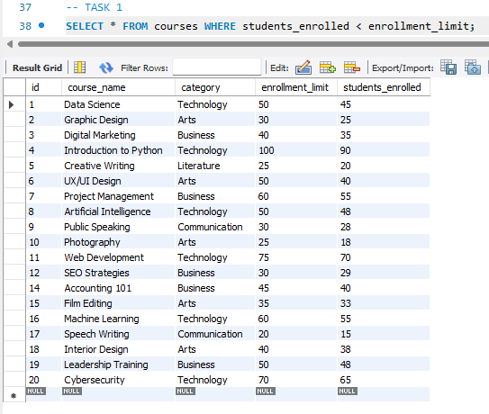
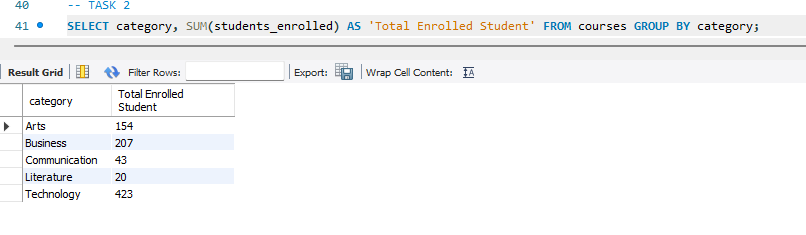
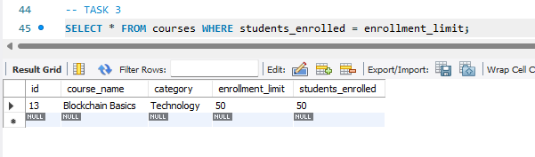
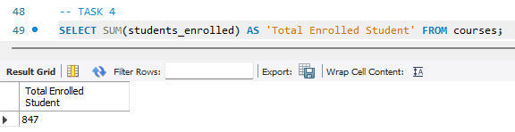
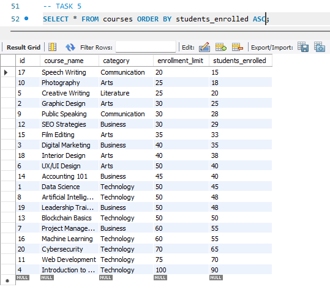

## Finals Task 3. Using MYSQL Clause
### Instructions:
1.	Create a database named online_courseDB
2.	Use the online_courseDB
3.	Copy and paste the initial query then perform the SELECT statements required for each problems in the figure below: [download onlineCourse.sql file](file/online_courses.sql)     
`CREATE TABLE courses  
( id INT AUTO_INCREMENT PRIMARY KEY,
course_name VARCHAR(255) NOT NULL,  
category VARCHAR(100) NOT NULL,  
enrollment_limit INT NOT NULL,  
students_enrolled INT NOT NULL );`

`INSERT INTO courses (course_name, category, enrollment_limit, students_enrolled)
VALUES  
    ('Data Science', 'Technology', 50, 45),  
    ('Graphic Design', 'Arts', 30, 25),  
    ('Digital Marketing', 'Business', 40, 35),  
    ('Introduction to Python', 'Technology', 100, 90),  
    ('Creative Writing', 'Literature', 25, 20),  
    ('UX/UI Design', 'Arts', 50, 40),  
    ('Project Management', 'Business', 60, 55),  
    ('Artificial Intelligence', 'Technology', 50, 48),  
    ('Public Speaking', 'Communication', 30, 28),  
    ('Photography', 'Arts', 25, 18),  
    ('Web Development', 'Technology', 75, 70),  
    ('SEO Strategies', 'Business', 30, 29),  
    ('Blockchain Basics', 'Technology', 50, 50),  
    ('Accounting 101', 'Business', 45, 40),  
    ('Film Editing', 'Arts', 35, 33),  
    ('Machine Learning', 'Technology', 60, 55),  
    ('Speech Writing', 'Communication', 20, 15),  
    ('Interior Design', 'Arts', 40, 38),  
    ('Leadership Training', 'Business', 50, 48),  
    ('Cybersecurity', 'Technology', 70, 65);`

## Item Description
the following are already implemented
- A table named courses with the following fields: 
  - id: Unique integer, auto-increment, primary key. 
  - course_name: String (VARCHAR), not null. 
  - category: String (VARCHAR), not null. 
  - enrollment_limit: Integer, not null. 
  - students_enrolled: Integer, not null.
- 20 courses are already present. 

## The following are the tasks that need to be implemented using MySQL statements. Make sure to complete them in the order specified:
### Task 1:
#### Retrieve all courses where students_enrolled is less than the enrollment_limit.  
### table structure and sql query
##### `SELECT * FROM courses WHERE students_enrolled < enrollment_limit;`

### Task 2:
#### Group courses by category and calculate the total number of students enrolled for each category. 
### table structure and sql query
##### `SELECT category, SUM(students_enrolled) AS 'Total Enrolled Student' FROM courses GROUP BY category;`

### Task 3:
#### Retrieve the courses that are fully enrolled (i.e., students_enrolled equals enrollment_limit).
### table structure and sql query
##### `SELECT * FROM courses WHERE students_enrolled = enrollment_limit;`

### Task 4:
#### Calculate the total number of students enrolled across all courses.
### table structure and sql query
##### `SELECT SUM(students_enrolled) AS 'Total Enrolled Student' FROM courses;`

### Task 5:
#### Sort courses by students_enrolled in ascending order.
### table structure and sql query
##### `SELECT * FROM courses ORDER BY students_enrolled ASC;`

## Here is the MySQL file
[MySQL File](file/online_coursedb_courses.sql)
## Required Outputs
1. Query statements (Task 1-5)
2. Output of each query (Task 1-5)
3. SQL copy of the database and table structures
